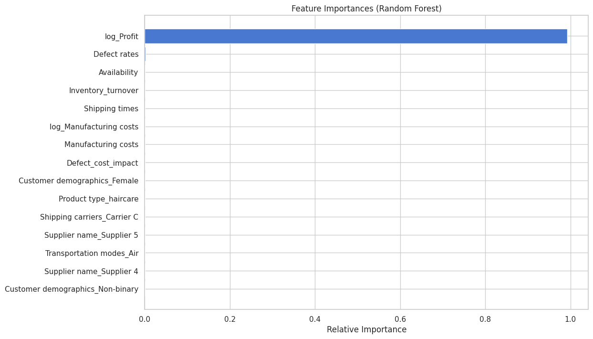
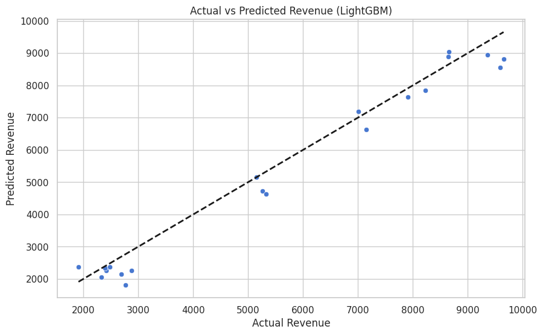

# 📦 Supply Chain Analysis using Machine Learning

A machine learning-based system for analyzing, modeling, and predicting revenue within the supply chain. It leverages powerful regression algorithms and rich feature engineering to extract business insights and support decision-making across inventory, production, logistics, and sales.

---

## 📈 Features

- 🔍 Automated Exploratory Data Analysis (EDA)
- 🧹 Robust Data Preprocessing and Feature Engineering
- 📊 Feature Selection using `SelectKBest`
- 🤖 Multiple Regressor Models:
  - Linear Regression
  - Random Forest
  - CatBoost
  - LightGBM
- 🛠️ Hyperparameter Tuning with `GridSearchCV`
- 📉 Residual and Prediction Analysis
- 🧠 Business Insights & Recommendations
- 💾 Model Export for Deployment (`.pkl`)

---
### 📌 Sample Visualizations

#### 🔧 Feature Importances (Random Forest)


#### 🎯 Actual vs Predicted Revenue


#### 📉 Residuals Distribution


---

## 📷 Suggested Plots to Export for `images/` Folder

You already generate the following — just **save them as images** in your script like this:

```python
plt.savefig('images/feature_importance.png')


